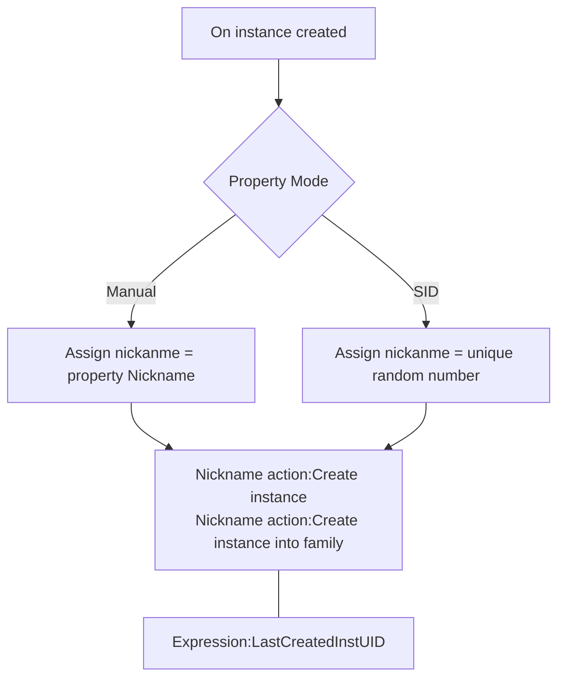

## Introduction

This plugin could be replaced by `system action: create object by name`, `system condition: pick last created`.

## Introduction

Assign a nickname of this object.

Icon: [Icons8](https://icons8.com/)

## Links

- [Plugin](https://rexrainbow.github.io/C3RexDoc/repo/rex_bnickname.c3addon)

## Dependence

- [rex_nickname](rex_nickname.md)

## Usage

[Sample capx](https://1drv.ms/u/s!Am5HlOzVf0kHlxx0DXBqnW2Wsa7o)

1. Assign nickname, when instance created
    - Equal to `Action:Assign nickname` in [rex_nickname](rex_nickname.md)
    - Property `Mode`
        - `Manual` : nickname = property `Nickname`
        - `SID` : nickname = an unique random number  ([Sample capx](https://1drv.ms/u/s!Am5HlOzVf0kHlx2RHC64W4gFL1gs))
2. Create instance by action in [rex_nickname](rex_nickname.md)
    - `Action:Create instance`
    - `Action:Create instance into family`