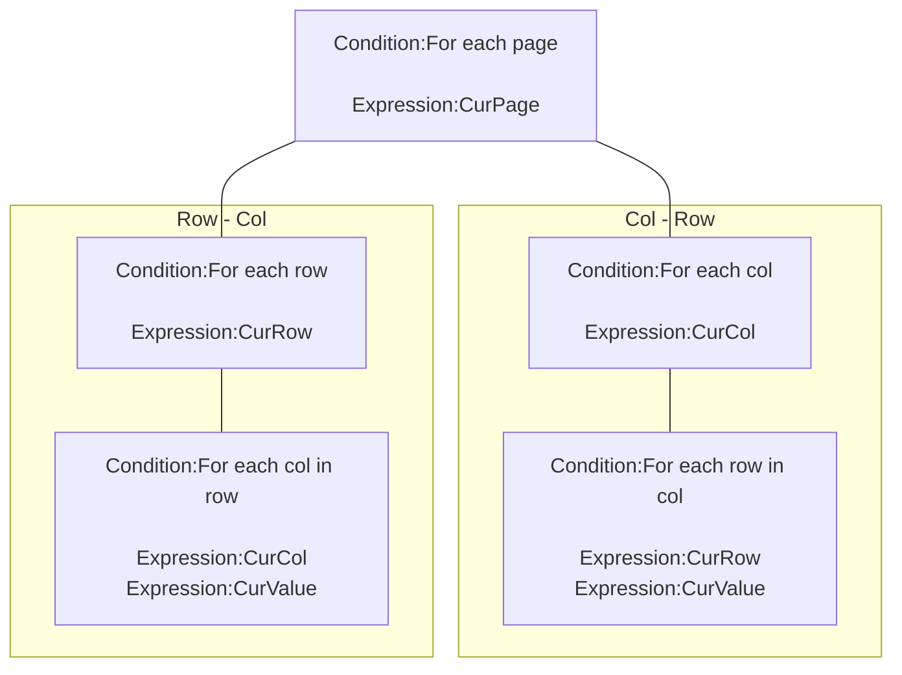

## Introduction

Read 2d table from [csv](https://en.wikipedia.org/wiki/Comma-separated_values) string.

Icon: [Icons8](https://icons8.com/)

##Links

- [Plugin](https://rexrainbow.github.io/C3RexDoc/repo/rex_csv.c3addon)

## Dependence

None

## Usage

### Write

[Sample capx](https://1drv.ms/u/s!Am5HlOzVf0kHlxALYdS7pSJjRxxf)

#### Load table

- `Action:Load table`
    - Delimiter : property `Delimiter` or `Action:Set delimiter`
        - `Expression:Delimiter`
    - First row : 
        - First column : empty
        - Other columns : column keys
    - Other rows : 
        - First column : row key
        - Other columns : data

    - For example, table :

        |       | a    | b    |
        | ----- | ---- | ---- |
        | **c** | 10   | 20   |
        | **d** | 30   | 40   |

        exported csv string :

        ```JSON
        ,a,b
        c,10,20
        d,30,40
        ```

        2d table in JSON (`Expression:TableToString`)
        
        ```json
        {
          "a":{
            "c":10,
            "d":30
          },
          "b":{
            "c":20,
            "d":40
          }
        }
        ```

- Load multiple tables  ([Sample capx](https://1drv.ms/u/s!Am5HlOzVf0kHlxEAYLyitgjlGARg))
    
    1. `Action:Turn page`
         - Default page name : `"_"`
    2. `Action:Load table`

##### Data type

[Sample capx](https://1drv.ms/u/s!Am5HlOzVf0kHlxKJMQZJacL8FcOb)

Property `Eval mode`

- `No` : string
    - Convert column or row to number type after load table
        - `Action:Convert row`
        - `Action:Convert col`

- `Yes` :  parse value by *eval* function of javascrpt
    - number: `10`
    - string: `'hi'`
    - javascript function: `Math.random()`
    
    For example, 
    
    ```json
    ,Name,HP,MP
    char1,'aaa',100,20
    char2,'bbb',80,30
    ```

    Error message will display on console when eval failed.

#### Set cell

- `Action:Set value`, `Action:Add to`  ([Sample capx](https://1drv.ms/u/s!Am5HlOzVf0kHlxMoiqycAJazGLK9))
- `Action:Set value at page`, `Action:Add at page`
- `Action:Clear`, to clean all cells

#### Append column or row 

- `Action:Append a column`
- `Action:Append a row`

#### Remove column or row

- `Action:Remove a column`
    - Parameter `Col`
        - String : column name
        - Number : index of column
- `Action:Remove a row`
    - Parameter `Row`
        - String : Row name
        - Number : index of row

#### Sort

[Sample capx](https://1drv.ms/u/s!Am5HlOzVf0kHlxRRlNfIuE_3j9fk)

- `Action:Sort items in col`
- `Action:Sort items in row`

### Read

#### Read cell

- `Expression:At(col, Row)`, `Expression:At(Col, Row, Page)`
    - Parameter `col` or `row`

        - String : column/row name
        - Number : index of column/row
        
        For example
        
        |       | a    | b    |
        | ----- | ---- | ---- |
        | **c** | 10   | 20   |
        | **d** | 30   | 40   |
        
        Expression:At("b", "d") = Expression:At(1, 1) = 40 

    - Page, column, row of the last `Expression:At`  
        - `Expression:AtPage`
        - `Expression:AtCol`
        - `Expression:AtRow`

#### Retrieve cells



- Retrieve pages
    - `Condition:For each page`
        - `Expression:CurPage`
- Retrieve columns
    - `Condition:For each col`
        - `Expression:CurCol`
        - `Condition:For each row in col`
            - `Expression:CurRow`
            - `Expression:CurValue`
    - `System condition: For`, from 0 to `Expression:ColCnt` -1
- Retrieve rows
    - `Condition:For each row`
        - `Expression:CurRow`
        - `Condition:For each col in row`
            - `Expression:CurCol`
            - `Expression:CurValue`
    - `System condition: For`, from 0 to `Expression:RowCnt` -1

#### Previous/next column or row

[Sample capx](https://1drv.ms/u/s!Am5HlOzVf0kHlxV83WHMwhx4jWCy)

- Previous/ next column
    - `Expression:PreviousCol`
    - `Expression:NextCol`
- Previous/ next row
    - `Expression:PreviousRow`
    - `Expression:NextRow`

#### Is existed

- Has column or row
    - `Condition:Has col`
    - `Condition:Has row`
    - `Condition:Cell is valid`
- Data in column or row
    - `Condition:Data in col`
    - `Condition:Data in row`
- Query
    - Load csv to [rex_taffydb](rex_taffydb.md) to query rows.

#### Amount of column or row

- `Expression:ColCnt`
- `Expression:RowCnt`

#### Read csv string

[Sample capx](https://1drv.ms/u/s!Am5HlOzVf0kHlxZRiSOsl1Y-dQys)

- `Expression:TableToCSV`

----

### Save & load

- It supports official saving & loading feature.
- Manual save & load
    - Save & load a table
        - `Expression:TableToString` -> `Action:Load one table`
    - Save & load all tables
        - `Expression:AllTalbesToString` -> `Action:Load all tables`

------

### Debug panel

- Dump cells in a column `Col` at `Page`
    - Set cell value at respond cell