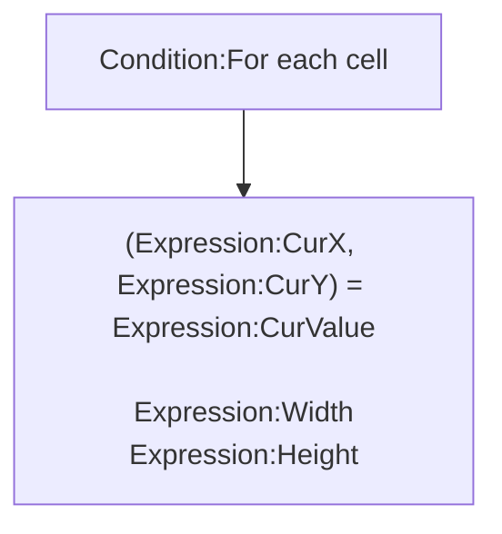

## Introduction

Load content of official array object from [csv](https://en.wikipedia.org/wiki/Comma-separated_values) string.

Icon: [Icons8](https://icons8.com/)

##Links

- [Plugin](https://rexrainbow.github.io/C3RexDoc/repo/rex_csv2array.c3addon)

## Dependence

None

## Usage

### Load to array

[Sample capx](https://1drv.ms/u/s!Am5HlOzVf0kHl0wouPYWV9zCPhsl)

- `Action:Put csv data into array`
    - Delimiter : property `Delimiter` or `Action:Set delimiter`
        - `Expression:Delimiter`
    - Format of csv :

        ```
        data00,data01,data02,data03,...
        data10,data11,data12,data13,...
        data20,data21,data22,data23,...
        ...
        ```


#### Data type

Property `Eval mode`

- `No` : string
- `Yes` :  parse value by *eval* function of javascrpt
    - number: `10`
    - string: `'hi'`
    - javascript function: `Math.random()`


### Retrieve cells



- `Condition:For each cell`
    - (`Expression:CurX`, `Expression:CurY`) = `Expression:CurValue`
        - Property `Eval mode`
    - `Expression:Width`, width of csv cells
    - `Expression:Height`, height of csv cells

### More examples

- [Split string](https://1drv.ms/u/s!Am5HlOzVf0kHl0uu58UX_Re22d8Q)