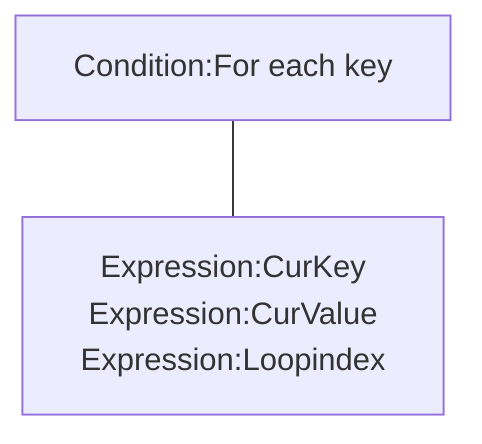

## Introduction

Manipulate [JSON](http://www.json.org/) data.

Icon: [Icons8](https://icons8.com/)

## Links

- [Plugin](https://rexrainbow.github.io/C3RexDoc/repo/rex_hash.c3addon)

## Dependence

None

## Usage

### Load

`Action:Load JSON`

### Content

`Expression:AsJSON`

### Dictionary

#### Write

- `Action:Set value`
- `Action:Add to`  ([Sample capx](https://1drv.ms/u/s!Am5HlOzVf0kHl1L713SDtP4zZvu_))
- `Action:Set JSON`
- `Action:Remove key`
- `Action:Clean all`
- `Action:Merge`, to merge another JSON  ([Sample capx](https://1drv.ms/u/s!Am5HlOzVf0kHl0-7jujgRp7c-WPl))

Parameter `Key` is a string with dot notation. For example, content is

```json
{
  "a":10,
  "b":{
    "c":30
  },
  "d": 40
}
```

Set `root.b.c` by key `b.c`.

New object will be created if not exists.

#### Read

##### Read a value

- `Expression:At( keys )`, keys in a string with dot notation
  - `Expression:At( "" )`, returns root
- `Expression:At( keys , defaultValue )`, return `defaultValue` if keys is not existed
- `Expression:AtKeys( key0, key1, ... )`, keys in parameters

For example get value at `root.b.c` :

```json
Expression:At( "b.c" ),
Expression:AtKeys( "b", "c" )
```

- `Condition:Key exists`, returns true if key is existed
- `Expression:RandomKeyAt`, returns a random key in object

##### Retrieve keys in object



- `Condition:For each key`  [Sample capx](https://1drv.ms/u/s!Am5HlOzVf0kHl1Bx0l_wFAmwcdvM)
    - `Expression:CurKey`
        - `Expression:CurValue( keys )`, child in current item
    - `Expression:Loopindex`, loop index of current for each
- `Action:Pick keys`, put all keys in object into an official array.  [Sample capx](https://1drv.ms/u/s!Am5HlOzVf0kHl1FPY_PSPv7RXzCX)
- `Expression:ItemCnt`, amount of keys in object
    - `0` : this object is a number or a string
    - `-1` : object is not existed

### Array

#### Write

- Initial an array
    - `Action:Set JSON` with parameter `JSON` to `[]`
- Push
    - `Action:Push value`
    - `Action:Push JSON`  [Sample capx](https://1drv.ms/u/s!Am5HlOzVf0kHl1NqJjar0n6NLXIi)
- Insert
    - `Action:Insert value`
    - `Action:Insert JSON`
- Remove
    - `Action:Remove key`
- Array length
    - `Expression:ItemCnt`
- Order
    - `Action:Sort`  [Sample capx](https://1drv.ms/u/s!Am5HlOzVf0kHl1V1t_F2FMqbiG-K)
    - `Action:Shuffle`  [Sample capx](https://1drv.ms/u/s!Am5HlOzVf0kHl1QERXzjUnmgpSqs)

#### Read

##### Read a value

- `Expression:At( keys )`, keys in a string with dot notation
- `Expression:AtKeys( key0, key1, ... )`
- `Expression:Pop`, pop the last item
    - `Expression:Pop(keys, index)`, pop item at index

##### Retrieve keys in array

- `Condition:For each key`  [Sample capx](https://1drv.ms/u/s!Am5HlOzVf0kHl1ZHP4eeKSoNOfF-)
    - `Expression:CurKey`
        - `Expression:CurValue( keys )`, child in current item
    - `Expression:Loopindex`, loop index of current for each
- `System condition:For`, from `0`  to `Expression:ItemCnt - 1`

------

### Save&Load

This plugin support official save/load system.