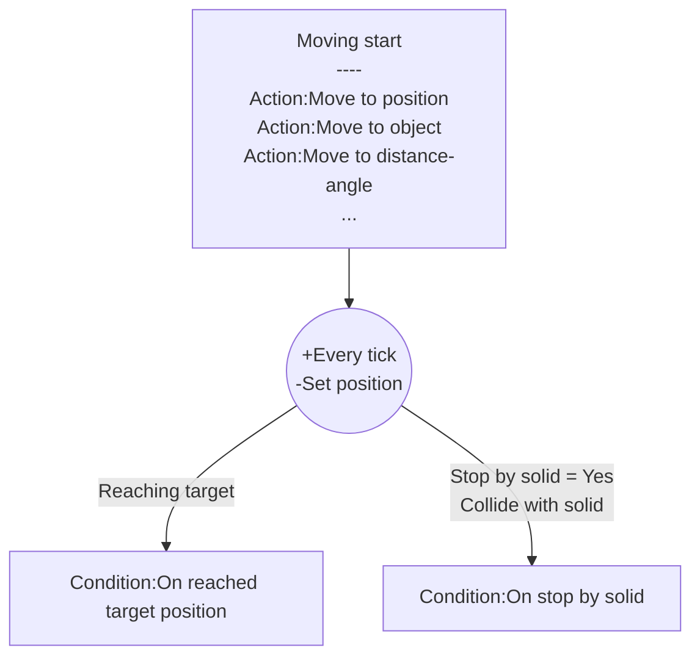

## Introduction

Move object to specific position.

Icon: [Icons8](https://icons8.com/)

## Links

- [Plugin](https://rexrainbow.github.io/C3RexDoc/repo/rex_moveto.c3addon)

## Dependence

None

## Usage

### Move start

[Sample capx](https://1drv.ms/u/s!Am5HlOzVf0kHlwrfXnweyYMy7cLe)

- `Action:Move to position`
- `Action:Move to delta XY`
- `Action:Move to object` 
- `Action:Move to distance-angle`

Target position is (`Expression:TargetX` , `Expression:TargetY`).

### Reach target

- `Condition:On reached target position`

### Stop

- `Action:Stop`

### Pause

- `Action:Set activated` and set parameter  `State` to `Disabled`

### Resume

- `Action:Set activated` and set parameter  `State` to `Enabled `

#### Stopped by solid object

[Sample capx](https://1drv.ms/u/s!Am5HlOzVf0kHlwv9Pho_7fWdMMGv)

Stop moving  when colliding any solid object

- Set property `Stop by solid`  to `Yes`, or  `Action:Stop by solid`
- Trigger `Condition:On stopped by solid` when stopped by solid object

### Continue mode

- Set property `Continued mode` to `Yes` 
    - Moving action under `Condition:On hit target position` will move forward immediately using remaining delta time

### Moving angle

- `Expression:MovingAngle` :  angle from previous position to current position.
- `Expression:MovingAngleStart` : angle from moving-start position to target position.

----

### Waypoints

Add [command queue behavior](rex_bcmdqueue.md) to pend target positions to make a series of waypoints.