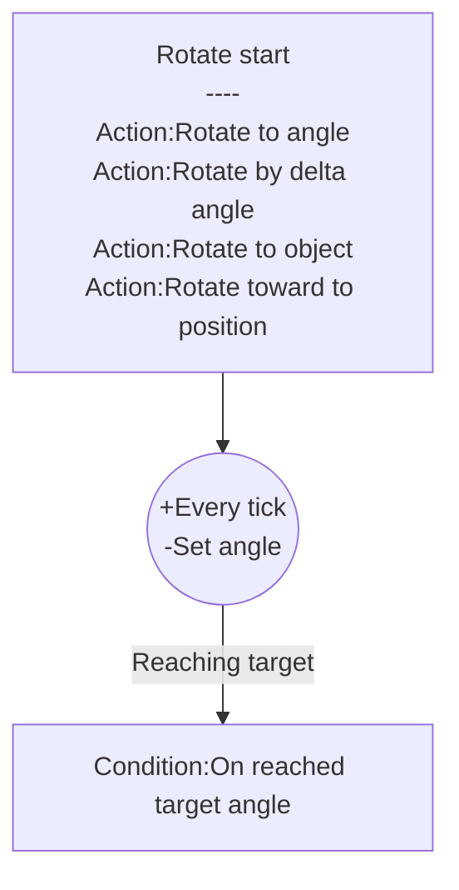

## Introduction

Spin object to specific angle.

Icon: [Icons8](https://icons8.com/)

## Links

- [Plugin](https://rexrainbow.github.io/C3RexDoc/repo/rex_rotateto.c3addon)

## Dependence

None

## Usage

### Rotate start
[Sample capx](https://1drv.ms/u/s!Am5HlOzVf0kHl0FW4b_JRRBQogVM)

- `Action:Rotate to angle`
- `Action:Rotate by delta angle`
- `Action:Rotate to object` 
- `Action:Rotate toward to position`

Target angle is `Expression:TargetAngle`

### Reach target

- `Condition:On reached target angle`

### Stop

- `Action:Stop`

### Pause

- `Action:Set enabled` and set parameter  `State` to `Disabled`

### Resume

- `Action:Set enabled` and set parameter  `State` to `Enabled `