# [Categories](categories.index.html) > [Movement](movement.index.html) > rex_boids

## Introduction

Calculate steer force by flocking algorithm.

- Cohesion: stay close to the centre of the flock
- Alignment: head in the same direction of the flock
- Separation: avoid collisions with flock

This behavior would **NOT** change any property of instance. It only calculates **steer force** for reference.

Icon: [Icons8](https://icons8.com/)

## Links

- [Plugin](https://rexrainbow.github.io/C3RexDoc/repo/rex_moveto.c3addon)

----

[TOC]

## Dependence

None

## Usage

```mermaid
graph TB

everyTick["Every tick"] --> cleanForce
cleanForce["Action:Clean"] --> pickNeighbors0["Pick neighbors<br>(Official Line-of-sight)"]
pickNeighbors0 --> addCohesion["Action:Cohesion"]
cleanForce --> pickNeighbors1["Pick neighbors<br>(Official Line-of-sight)"]
pickNeighbors1 --> addAlignment["Action:Alignment"]
cleanForce --> pickNeighbors2["Pick neighbors<br>(Official Line-of-sight)"]
pickNeighbors2 --> addSeparation["Action:Separation<br>(Avoid obstacles)"]
cleanForce--> addForce["Action:Apply force towards position<br>Action:Apply force at angle"]

addCohesion --> hasForce["Condition:Has force"]
addAlignment --> hasForce
addSeparation --> hasForce
addForce --> hasForce

hasForce --> expForce["Move forward, or rotate instance<br>----<br>>Polar axis: Expression:ForceAngle, Expression:ForceMagnitude<br>Orthogonal axis: Expression:ForceDx, Expression:ForceDy"]
```

[Sample capx](https://1drv.ms/u/s!Am5HlOzVf0kHl1nPGusnlzKJvb7m)

1. `Action:Clean`, to clean steer force to 0
2. Pick `Neighbors` parameter by [official line-of-sight behavior](https://www.scirra.com/manual/163/line-of-sight)
   - `Action:Cohesion`
   - `Action:Alignment`
   - `Action:Separation`
     - Avoid obstacles
3. Apply steer force, optional
   - `Action:Apply force towards position`
   - `Action:Apply force at angle`
4. `Condition:Has force`, return true if force is not 0
   - Polar axis: `Expression:ForceAngle`, `Expression:ForceMagnitude`
   - Orthogonal axis: `Expression:ForceDx`, `Expression:ForceDy`