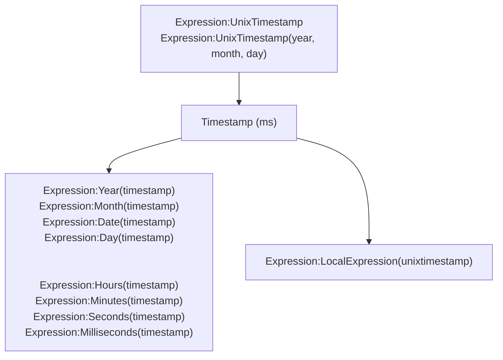
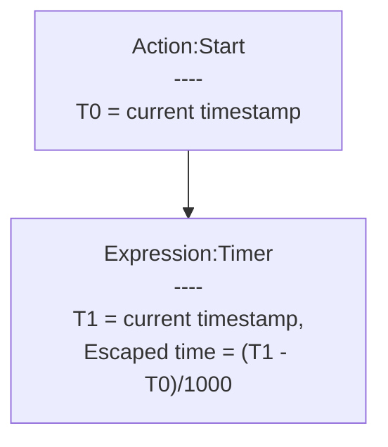

# [Categories](categories.index.html) > [Date&time](date.index.html) > rex_date

## Introduction

Get system date and time.

Icon: [Icons8](https://icons8.com/)

## Links

- [Plugin](https://rexrainbow.github.io/C3RexDoc/repo/rex_date.c3addon)

----

[TOC]

## Dependence

None

## Usage

### Get date

[Sample capx](https://1drv.ms/u/s!Am5HlOzVf0kHlwWZfzECwLvBc7oJ)

1. `Expression:UnixTimestamp`, to get current timestamp
   - `Expression:UnixTimestamp(year, month, day)`, to get timestamp at year/month/day
   - `Expression:UnixTimestamp(year, month, day, hours, minutes, seconds)`, to get timestamp at year/month/day/hours/minutes/seconds

2. Get date

   *It is recommended using [rex_momentjs](rex_momentjs.html) to get formatted date string*

   - `Expression:Year(timestamp)`
   - `Expression:Month(timestamp)`
   - `Expression:Date(timestamp)`
   - `Expression:Day(timestamp)`
   - `Expression:Hours(timestamp)`
   - `Expression:Minutes(timestamp)`
   - `Expression:Seconds(timestamp)`
   - `Expression:Milliseconds(timestamp)`
   - `Expression:LocalExpression(unixtimestamp)`, to get  local date expression string  ([Sample capx](https://onedrive.live.com/redir?resid=7497FD5EC94476E!2005&authkey=!ALPkWoHGnr0yflU&ithint=file%2ccapx))

Or get current date directly by

- `Expression:Year`
- `Expression:Month`
- `Expression:Date`
- `Expression:Day`
- `Expression:Hours`
- `Expression:Minutes`
- `Expression:Seconds`
- `Expression:Milliseconds`
- `Expression:LocalExpression`

(*not recommended*, [sample capx](https://onedrive.live.com/redir?resid=7497FD5EC94476E%21518&authkey=%21AE0tB7g9lHRUElM&ithint=file%2c.capx)) 

#### Get delta time

[Sample capx](https://1drv.ms/u/s!Am5HlOzVf0kHlwb_GepisVKba0Za)

Subtract two timestamp (`Expression:UnixTimestamp`)

----

### Escaped time

[Sample capx](https://1drv.ms/u/s!Am5HlOzVf0kHlwdXjTTC_hkV0JVu)

1. `Action:Start`, to start a timer

2. `Expression:Timer`, to get escaped time, in seconds

   - Control
     - `Action:Pause`
     - `Action:Resume`

   ​