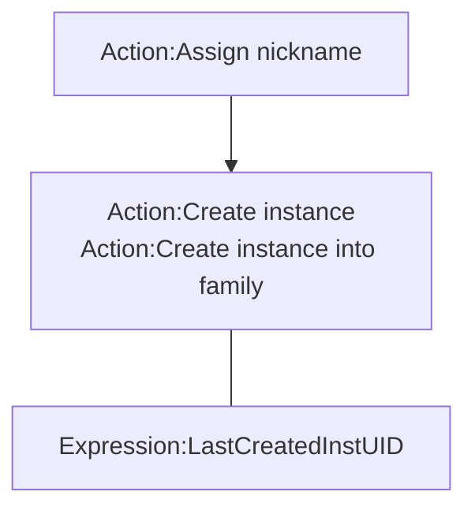

# [Categories](categories.index.html) > [System](system.index.html) > rex_nickname

## Introduction

Create instance by string.

Icon: [Icons8](https://icons8.com/)

## Links

- [Plugin](https://rexrainbow.github.io/C3RexDoc/repo/rex_nickname.c3addon)

----

[TOC]

## Dependence

None

## Usage

### Create instance

1. `Action:Assign nickname`, to add an alias name of an object type
2. Create instance
   - `Action:Create instance`  ([Sample capx](https://1drv.ms/u/s!Am5HlOzVf0kHlxj7ozEtjPsyEnjH))
     - Configure instance under its `condition:on created`  ([Sample capx](https://1drv.ms/u/s!Am5HlOzVf0kHlxmnBNu-1LxnwfXm))
     - Set properties (x, y, angle, opacity,...) of instance by [rex_uid2prop](rex_uid2prop.html) with `Expression:LastCreatedInstUID`  ([Sample capx](https://onedrive.live.com/redir?resid=7497FD5EC94476E!1948&authkey=!AJBjcYFseVb0u90&ithint=file%2ccapx))
   - `Action:Create instance into family`  ([Sample capx](https://1drv.ms/u/s!Am5HlOzVf0kHlxoez0Wyvb0sye5Y))
     - Configure instance by SOL of family object

### Pick instance by nickname

- Matching name string exactly  ([Sample capx](https://1drv.ms/u/s!Am5HlOzVf0kHlx6TmfhG3YtIFwaf))
  - `Condition:Pick instances`
  - `Action:Pick all instances`
- Matching sub-string  ([Sample capx](https://1drv.ms/u/s!Am5HlOzVf0kHlx8ynRFX0chHxqA_))
  - `Condition:Pick  matched instances`,
  - `Action:Pick matched instances`

### Debug panel

All alias names and its mapped object type name will be shown on debug panel.