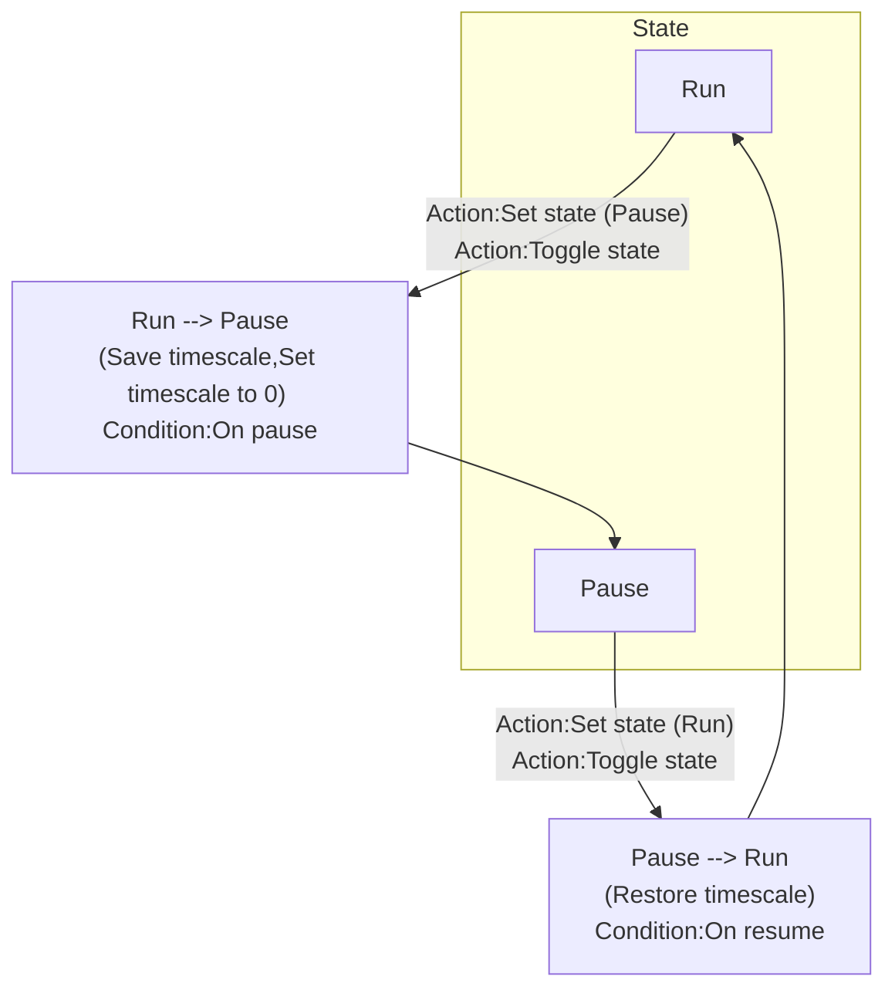

# [Categories](categories.index.html) > [System](system.index.html) > rex_pause

## Introduction

Pause/resume system by setting [timescale](https://www.scirra.com/tutorials/67/delta-time-and-framerate-independence#h2a5).

Icon: [Icons8](https://icons8.com/)

## Links

- [Plugin](https://rexrainbow.github.io/C3RexDoc/repo/rex_pause.c3addon)

----

[TOC]

## Dependence

None

## Usage

[Sample capx](https://1drv.ms/u/s!Am5HlOzVf0kHlwFG8r0RwUxhHd5M)

- State : Run
  - Event : go to state Pause
    - `Action:Toggle state`, or 
    - `Action:Set state` with parameter `State` to `Pause`
  - State Transition : Run to Pause
    1. Store current timescale
       - `Expression:PreTimescale`
    2. Set timescale to `0`
    3. Trigger `Condition:On pause`
- State : Pause
  - Event : go to state Run
    - `Action:Toggle state`, or 
    - `Action:Set state` with parameter `State` to `Run`
  - State Transition : Pause to Run
    1. Restore timescale to `Expression:PreTimescale`
    2. Trigger `Condition:On resume`