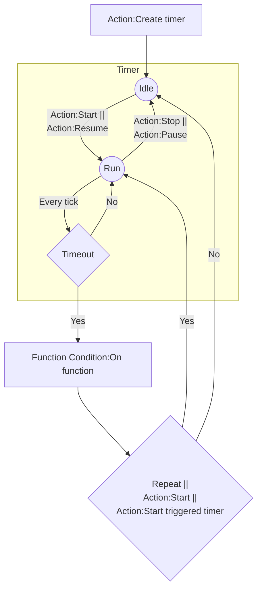

# [Categories](categories.index.html) > [Timer](timer.index.html) > rex_timeline

## Introduction

Run function when time-out. It is also a base plugin for my timer-related plugins or behaviors.

Icon: [Icons8](https://icons8.com/)

## Links

- [Plugin](https://rexrainbow.github.io/C3RexDoc/repo/rex_timeline.c3addon)

----

[TOC]

## Dependence

- Function object for callback, optional
  - [Official function plugin](https://www.scirra.com/manual/149/function), or 
  - [rex_function2 plugin](rex_function2.html)

## Usage

### Timeline

- Update timeline - property `Game time`
  - `Yes` : update timeline by engine time = *system time* * *timescale*
  - `Real-time` : update timeline by *system time*
    - Timeline will not stop when *timescale = 0*
  - `No` : update timeline by `Action:Push timeline forward`, or `Action:Push timeline to`  ([sample capx](https://1drv.ms/u/s!Am5HlOzVf0kHl31BsugO0WCCAMuu))
- Timers on this timeline
  - `Action:Pause timeline`, to pause all timers registed on this timeline
  - `Action:Resume timeline`
  - `Action:Clean`, to remove all timers registed on this timeline
- `Expression:TimeLineTime`, returns current time of timeline.

----

### Timer

[Sample capx](https://1drv.ms/u/s!Am5HlOzVf0kHl3445e0aiCbmH8-T)

1. `Action:Create timer`, to create a timer and its callback

   - Callback object
     - [Official function plugin](https://www.scirra.com/manual/149/function) or [rex_function2 plugin](rex_function2.html)
     - `Action:Setup callback`, to assign callback object manually  ([sample capx](https://onedrive.live.com/redir?resid=7497FD5EC94476E!1977&authkey=!AE91fhl7SAUwPjw&ithint=file%2ccapx))
   - Parameter `Name`, `Parameter`: function name and parameters of callback

2. `Action:Start`

   - Parameter `Repeat` : restart timer repeatedly. Set `0` to repeat timer infinity

3. Every tick

   - Time
     - `Expression:TimerDelayTime`
     - `Expression:TimerRemainder`, `Expression:TimerRemainderPercent`
     - `Expression:TimerElapsed`. `Expression:TimerElapsedPercent`

   - Timer control
     - `Action:Pause`, `Action:Resume`
     - `Action:Stop`
     - `Condition:Is timer running`

4. Timeout

   - Trigger `Condition:On function` of callback object
     - `Expression:TriggeredTimerName`
     - `Action:Start triggered timer`
     - `Action:Delete triggered timer`
     - `Action:Set parameters`, to change parameters of callback for next invoking

- Stop and delete timer
  - `Action:Delete`
  - `Action:Delete triggered timer`

#### More samples

- [Revive](https://1drv.ms/u/s!Am5HlOzVf0kHl38THeBx6q_tloyy)